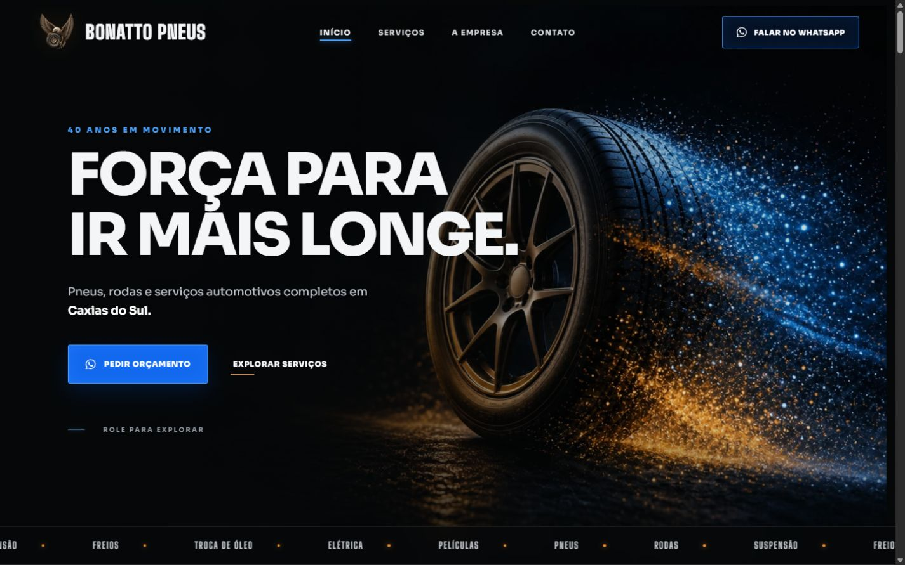

# Bonatto Pneus

[](https://react.dev/)
[](https://vite.dev/)
[](https://workers.cloudflare.com/)
[](https://github.com/Lucas-Bonatto/bonatto-pneus-site/actions/workflows/ci.yml)

Site institucional responsivo desenvolvido para a **Bonatto Pneus**, empresa de
Caxias do Sul com 40 anos de experiência em pneus, rodas e serviços
automotivos. O projeto combina uma identidade visual marcante com navegação
direta e chamadas para orçamento pelo WhatsApp.

[Acessar o site](https://pneusbonatto.com.br/)



## Sobre o projeto

O site foi planejado para apresentar a empresa, organizar seu portfólio de
serviços e reduzir o caminho entre a visita e o contato comercial. A experiência
é adaptada para desktop e celular, com atenção especial à legibilidade,
performance e acessibilidade de movimento.

### Principais recursos

- navegação por seções com indicação do conteúdo ativo;
- páginas laterais por toque, arraste, teclado ou controles visuais;
- catálogo local de marcas de pneus, rodas, suspensão, freios e lubrificantes;
- galeria de modelos de pneus e rodas;
- tabela de valores para balanceamento e geometria;
- condições de pagamento para cartão e empresas com CNPJ;
- chamadas diretas para orçamento pelo WhatsApp;
- informações de contato, endereço, mapa e Instagram;
- menu mobile e layout responsivo;
- animações progressivas com suporte a `prefers-reduced-motion`;
- página 404 personalizada com status HTTP correto.

## Experiência responsiva

<table>
  <tr>
    <td align="center"><strong>Desktop</strong></td>
    <td align="center"><strong>Mobile</strong></td>
  </tr>
  <tr>
    <td></td>
    <td width="300"></td>
  </tr>
</table>

## Tecnologias e decisões técnicas

| Área | Solução |
| --- | --- |
| Interface | React 19 e componentes funcionais |
| Build | Vite 6 |
| Estilos | CSS responsivo, variáveis e animações próprias |
| Tipografia | Fontes locais com `@fontsource` |
| Ícones | React Icons |
| Imagens | WebP, PNG e SVG locais |
| Hospedagem | Cloudflare Workers Static Assets |
| Qualidade | Testes com Node.js e GitHub Actions |
| Segurança | CSP, HSTS e outros cabeçalhos HTTP |

O frontend não depende de um kit visual pronto. A composição, os componentes e
os comportamentos responsivos foram construídos especificamente para a
identidade da Bonatto Pneus.

Os nomes, logotipos e imagens de produtos identificam as respectivas marcas.
Modelos, medidas, estoque, taxas e condições comerciais devem ser confirmados
diretamente com a loja.

## Segurança e qualidade

Cada atualização na branch `main` passa automaticamente por um fluxo de CI que:

1. instala exatamente as versões registradas no lockfile;
2. audita dependências em busca de vulnerabilidades de alta severidade;
3. gera o build de produção;
4. executa os testes automatizados;
5. valida o pacote do Cloudflare antes da publicação.

O deploy também aplica políticas como Content Security Policy, HSTS, bloqueio
de enquadramento por terceiros e restrições de APIs sensíveis do navegador.

## Executar localmente

### Pré-requisitos

- Node.js 24 ou versão compatível;
- npm.

```bash
git clone https://github.com/Lucas-Bonatto/bonatto-pneus-site.git
cd bonatto-pneus-site
npm ci
npm run dev
```

O Vite exibirá o endereço local no terminal, normalmente
`http://localhost:5173`.

## Comandos disponíveis

| Comando | Finalidade |
| --- | --- |
| `npm run dev` | inicia o ambiente de desenvolvimento |
| `npm run build` | gera e prepara o build de produção |
| `npm run preview` | abre uma prévia local do build |
| `npm test` | executa os testes automatizados |
| `npm run security:check` | audita as dependências |
| `npm run check` | compila e testa o projeto |
| `npm run deploy:check` | valida o deploy do Cloudflare sem publicar |

## Estrutura do projeto

```text
bonatto-pneus-site/
├── .github/          # CI e atualizações automatizadas
├── docs/images/      # imagens usadas na documentação
├── public/           # imagens locais e cabeçalhos HTTP
├── scripts/          # preparação do build de produção
├── src/
│   ├── components/   # seções e componentes visuais
│   ├── data/         # catálogo e conteúdo comercial
│   ├── hooks/        # comportamentos compartilhados
│   └── styles.css    # sistema visual responsivo
├── tests/            # testes do pacote de produção
├── vite.config.mjs
└── wrangler.jsonc    # configuração do Cloudflare Workers
```

## Publicação

O Vite gera os arquivos estáticos em `dist/`, e o Cloudflare Workers faz a
entrega global do site. O arquivo `public/_headers` define as políticas de
segurança, enquanto `wrangler.jsonc` configura os assets e o tratamento da
página não encontrada.

---

Desenvolvido como uma presença digital moderna para a **Bonatto Pneus**.
